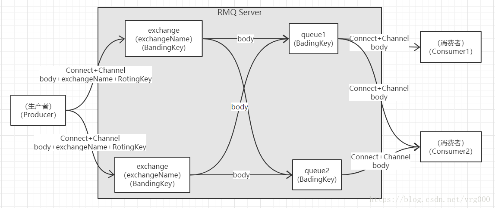
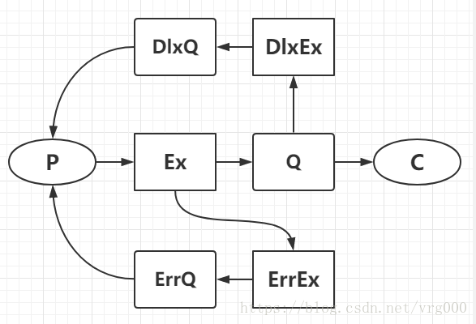

> 启动rabbitmq: sudo service rabbitmq-server start  
> 关闭rabbitmq: sudo service rabbitmq-server stop  
> 查看rabbitmq: sudo service rabbitmq-server status  
> 如果要检查队列，请尝试使用sudo rabbitmqctl list_queues命令。  
> rabbitmq的标准端口号是5672,,,web管理工具是localhost:15672


**RabbitMQ是一个消息代理：它接受并转发消息。你可以把它想象成一个邮局：当你把你想要邮寄的邮件放进一个邮箱时，你可以确定邮差先生或女士最终会把邮件送到你的收件人那里。在这个比喻中，RabbitMQ是一个邮箱、一个邮局和一个邮递员。**

RabbitMQ和邮局的主要区别在于它不处理纸张，而是接受、存储和转发二进制数据块——消息。  

RabbitMQ和一般的消息传递都使用一些术语.   
  
- 生产仅意味着发送。发送消息的程序是生产者. P:(product)
- 队列是位于RabbitMQ内部的邮箱的名称。尽管消息通过RabbitMQ和你的应用程序流动，但它们只能存储在队列中。队列只受主机内存和磁盘限制的限制，实际上它是一个大的消息缓冲区。许多生产者可以向一个队列发送消息，而许多消费者可以尝试从一个队列接收数据。 queue_name   
- 消费与接收具有相似的含义。消费者是一个主要等待接收消息的程序. C:(consumer)

请注意，生产者，消费者和代理（broker）不必位于同一主机上。实际上，在大多数应用程序中它们不是。一个应用程序既可以是生产者，也可以是消费者.  


> 在定义queue与exchange里有个args参数,该参数可以设置一些arguments例如队列的长度啥乱七八糟的,可以在localhost:15672里新建queue或者新建exchange里看到Arguments  

- 发布/订阅模式中  
> 生产者只需要定义exchange交换器,然后再生产即可. 即需要定义: exchange, publish 
>   
> 而消费者端,需要添加队列,将队列与exchange交换器绑定在一起. 队列的定义直接用空就行了,会建一个临时队列,当断开连接就会删除该临时队列. 即需要定义: exchange, queue, queue bind, consume.  

<br/><br/>

## 基础概念
amqp：一种消息中间件协议，RMQ是amqp协议的一个具体实现。RMQ使用Erlang语言实现的，具有很好的并发能力，具体历史请百度，这里主要关心怎么用。  

- Producer：生产者，负责生产消息。
- Connect：连接，生产者与RMQ Server之间建立的TCP连接。
- Channel：信道，一条连接可包含多条信道，不同信道之间通信互不干扰。考虑下多线程应用场景，每个线程对应一条信道，而不是对应一条连接，这样可以提高性能。
- body：消息主体，要传递的数据。
- exchange：交换器，负责把消息转发到对应的队列。交换器本身没有缓存消息的功能，消息是在队列中缓存的，如果队列不存在，则交换器会直接丢弃消息。常用的有四种类型的交换器：direct、fanout、topic、headers。不同类型的交换器有不同的交换规则，交换器会根据交换规则把消息转发到对应的队列。
- exchangeName：交换器名称，每个交换器对应一个名称，发送消息时会附带交换器名称，根据交换器名称选择对应的交换器。
- queue：队列，用于缓存消息。
- BandingKey：绑定键，一个队列可以有一个到多个绑定键，通过绑定操作可以绑定交换器和队列，交换器会根据绑定键的名称找到对应的队列。
- RotingKey：路由键，发送消息时，需要附带一条路由键，交换器会对路由键和绑定键进行匹配，如果匹配成功，则消息会转发到绑定键对应的队列中。
- Consumer：消费者，负责处理消息。

<br/><br/>

## 参数讲解 
<br/>  

### 创建交换器  
> func (ch *Channel) ExchangeDeclare(name, kind string, durable, autoDelete, internal, noWait bool, args Table) error  

- name:交换器名称  
- kind:交换器类型,有四种常用的类型:direct,fanout,topic,headers  
- durable:是否持久化. 持久化会把交换器配置存盘  
- autoDelete:至少有一条绑定才可以触发自动删除,当所有绑定与之解绑后,会自动删除此交换器  
- internal:客户端无法直接发送msg到内部交换器,只有交换器可以发送msg到内部交换器  
- noWait:阻塞：表示创建交换器的请求发送后，阻塞等待RMQ Server返回信息。非阻塞：不会阻塞等待RMQ Server的返回信息，而RMQ Server也不会返回信息.(返回服务器Exchange.Declare-Ok这个命令)  
- args: argsTable,是个map,配置一些参数信息  

<br/>  

### 创建队列  
> func (ch *Channel) QueueDeclare(name string, durable, autoDelete, exclusive, noWait bool, args Table) (Queue, error)

- name:队列名称
- durable:持久化会把队列存盘，服务器重启后，不会丢失队列以及队列内的信息。（注：1、不丢失是相对的，如果宕机时有消息没来得及存盘，还是会丢失的。2、存盘影响性能。） 
- autoDelete:至少有一个消费者连接到队列时才可以触发。当所有消费者都断开时，队列会自动删除。
- exclusive:是否设置排他，true为是。如果设置为排他，则队列仅对首次声明他的连接可见，并在连接断开时自动删除。（注意，这里说的是连接不是信道，相同连接不同信道是可见的）  
- noWait:阻塞：表示创建交换器的请求发送后，阻塞等待RMQ Server返回信息。非阻塞：不会阻塞等待RMQ Server的返回信息，而RMQ Server也不会返回信息。（不推荐使用）
- args:argsTable,是个map,配置一些参数信息.如 x-message-ttl, x-expires, x-max-length, x-max-length-bytes, x-dead-letter-exchange, x-dead-letter-routing-key, x-max-priority等.  
注意:生产者和消费者都能够使用queueDeclare来声明一个队列,但是如果消费者在同一个信道上订阅了另一个队列,就无法再声明队列了.必须先取消订阅,然后将信道置为"传输"模式,之后才能声明队列.

<br/>  

### 队列绑定
> func (ch *Channel) QueueBind(name, key, exchange string, noWait bool, args Table) error

- name:队列名称
- key:BandingKey，表示要绑定的键.
- exchange:交换器名字
- noWait:阻塞：表示创建交换器的请求发送后，阻塞等待RMQ Server返回信息。非阻塞：不会阻塞等待RMQ Server的返回信息，而RMQ Server也不会返回信息。（不推荐使用）
- args:argsTable,是个map,配置一些参数信息

<br/>  

### 交换器绑定
> func (ch *Channel) ExchangeBind(destination, key, source string, noWait bool, args Table) error  
> 交换器与交换器绑定。

- destination：目的交换器，通常是内部交换器。
- key：对应图中BandingKey，表示要绑定的键。
- source：源交换器。
- noWait：是否非阻塞，true表示是。阻塞：表示创建交换器的请求发送后，阻塞等待RMQ Server返回信息。非阻塞：不会阻塞等待RMQ Server的返回信息，而RMQ Server也不会返回信息。（不推荐使用）
- args:argsTable,是个map,配置一些参数信息

<br/>  

### 发送消息
> func (ch *Channel) Publish(exchange, key string, mandatory, immediate bool, msg Publishing) error

- exchange：要发送到的交换机名称，对应图中exchangeName。
- key：路由键，对应图中RoutingKey。
- mandatory: 下面讲
- immediate: 下面讲
- msg：要发送的消息，msg对应一个Publishing结构，Publishing结构里面有很多参数，这里只强调几个参数，其他参数暂时列出，但不解释。

```shell
type Publishing struct {
        Headers Table
        // Properties
        ContentType     string //消息的类型，通常为“text/plain”
        ContentEncoding string //消息的编码，一般默认不用写
        DeliveryMode    uint8  //消息是否持久化，2表示持久化，0或1表示非持久化。
        Body []byte //消息主体
        Priority        uint8 //消息的优先级 0 to 9
        CorrelationId   string    // correlation identifier
        ReplyTo         string    // address to to reply to (ex: RPC)
        Expiration      string    // message expiration spec
        MessageId       string    // message identifier
        Timestamp       time.Time // message timestamp
        Type            string    // message type name
        UserId          string    // creating user id - ex: "guest"
        AppId           string    // creating application id
}
```
<br/>  

### 接受消息-推模式
> func (ch *Channel) Consume(queue, consumer string, autoAck, exclusive, noLocal, noWait bool, args Table) (<-chan Delivery, error)  
> RMQ Server主动把消息推给消费者

- queue:队列名称。
- consumer:消费者标签，用于区分不同的消费者。
- autoAck:是否自动回复ACK，true为是，回复ACK表示高速服务器我收到消息了。建议为false，手动回复，这样可控性强。
- exclusive:设置是否排他，排他表示当前队列只能给一个消费者使用。
- noLocal:如果为true，表示生产者和消费者不能是同一个connect。
- nowait：是否非阻塞，true表示是。阻塞：表示创建交换器的请求发送后，阻塞等待RMQ Server返回信息。非阻塞：不会阻塞等待RMQ Server的返回信息，而RMQ Server也不会返回信息。（不推荐使用）
- args:argsTable,是个map,配置一些参数信息  

注意下返回值：返回一个<- chan Delivery类型，遍历返回值，有消息则往下走， 没有则阻塞。

<br/>  

### 接受消息-拉模式
> func (ch *Channel) Get(queue string, autoAck bool) (msg Delivery, ok bool, err error)  
> 消费者主动从RMQ Server拉消息  
> 如果只想从队列获得单条消息而不是持续订阅,就用Get拉模式

- queue：队列名称
- autoAck：是否开启自动回复。

### 手动回复消息
```shell
func (ch *Channel) Ack(tag uint64, multiple bool) error
func (me Delivery) Ack(multiple bool) error {
        if me.Acknowledger == nil {
                return errDeliveryNotInitialized
        }
        return me.Acknowledger.Ack(me.DeliveryTag, multiple)
}
func (d Delivery) Reject(requeue bool) error
```
简单看一眼，函数2调用了函数1，本质上两个函数没区别。
这里推荐使用第二个，因为方便。
另外说一下multiple参数。true表示回复当前信道所有未回复的ack，用于批量确认。false表示回复当前条目。
函数三：
拒绝本条消息。如果requeue为true，则RMQ会把这条消息重新加入队列，如果requeue为false，则RMQ会丢弃本条消息。
注：推荐手动回复，尽量不要使用autoACK，因autoACK不可控。

<br/>

### Publish – mandatory参数
- false：当消息无法通过交换器匹配到队列时，会丢弃消息.
- true：当消息无法通过交换器匹配到队列时，会调用basic.return通知生产者。注：不建议使用，因会使程序逻辑变得复杂，可以通过备用交换机来实现类似的功能。

### Publish – immediate参数
- true：当消息到达Queue后，发现队列上无消费者时，通过basic.Return返回给生产者。
- false：消息一直缓存在队列中，等待生产者。注：不建议使用此参数，遇到这种情况，可用TTL和DLX方法代替（后面会介绍）。

总结: mandatory参数告诉服务器至少将该消息路由到一个队列中,否则将消息返回给生产者. immediate参数告诉服务器,如果该消息关联的队列上有消费者,则立刻投递;如果所有匹配的队列上都没有消费者,则直接将消息返还给生产者,不用将消息存入队列而等待消费者了;(RabbitMQ 3.0版本开始去掉了对immediate参数的支持,对此RabbitMQ官方解释是:immediate参数会影响镜像队列的性能,增加了代码复杂性,建议采用TTL和DLX的方法替代.)

### 备份交换器
Alternate Exchange,简称AE.生产者在发送消息的时候如果不设置mandatory参数,那么消息在未被路由的情况下将会丢失;使用备份交换器可以将未被路由的消息存储在RabbitMQ中,在需要的时候去处理这些消息.在声明交换器的时候添加alternate-exchange参数即可. 
```java
Map<String, Object> args = new HashMap<String, Object>(); 
args.put("alternate-exchange","myAe");
channel.exchangeDeclare("normalExchange","direct",true,false,args);
channel.exchangeDeclare("myAe","fanout",true,false,null);
channel.queueDeclare("normalQueue",true,false,false,null);
channel.queueBind("normalQueue","normalExchange","normalKey");
channel.queueDeclare("unroutedQueue",true,false,false,null);
channel.queueBind("unroutedQueue","myAe","");
```
上面的代码中声明了两个交换器normalExchange和myAe,分别绑定了normalQueue和unroutedQueue这两个队列,同时将myAe设置为normalExchange的备份交换器.注意myAe的交换器类型为fanout.

<br/>

### 备用交换机&TTL+DLX

借助备用交换机、TTL+DLX代替mandatory、immediate方案：  
1、P发送msg给Ex，Ex无法把msg路由到Q，则会把路由转发给ErrEx。  
2、msg暂存在Q上之后，如果C不能及时消费msg，则msg会转发到DlxEx。  
3、TTL为msg在Q上的暂存时间，单位为毫秒。  

- 通过设置参数，可以设置Ex的备用交换器ErrEx:  
创建Exchange时，指定Ex的Args – “alternate-exchange”:”ErrEx”。其中ErrEx为备用交换器名称
- 通过设置参数，可以设置Q的DLX交换机DlxEX:  
创建Queue时，指定Q的Args参数：  
“x-message-ttl”:0 //msg超时时间，单位毫秒  
“x-dead-letter-exchange”:”dlxExchange” //DlxEx名称  
“x-dead-letter-routing-key”:”dlxQueue” //DlxEx路由键  

消息的TTL:  
如果不设置TTL,则表示此消息不会过期;如果将TTL设置为0,则表示除非此时可以直接将消息投递到消费者,否则该消息会被立即丢弃,这个特性可以部分替代RabbitMQ 3.0版本之前的immediate参数,因为immediate参数在投递失败时会用Basic.Return将消息返回(该功能可以用死信队列来实现)  
队列的TTL:  
可通过args中的x-expires参数可以控制队列被自动删除前处于未使用状态的时间.未使用的意思是队列上没有任何的消费者,队列也没有被重新声明,并且在过期时间段内也未调用过Basic.Get命令.RabbitMQ会确保在过期时间到达后将队列删除,但是不保障删除的动作有多及时.在RabbitMQ重启后,持久化的队列的过期时间会被重新计算.  
注意,该参数不能设置为0,参数以毫秒为单位,比如1000表示该队列如果在1秒钟之内未使用则会被删除.
```shell
args["x-expires"] = 1000
```

<br/>

### 死信队列

DLX全称为Dead-Letter-Exchange,可以称为死信交换器,当消息在一个队列中变成死信(dead message)之后,它能被重新发送到另一个交换器中,这个交换器就是DLX,绑定DLX的队列就被称为死信队列.  
消息变成死信一般是由于以下几种情况:  
1.消息被拒绝(Basic.Reject/Basic.Nack),并且设置requeue参数为false;  
2.消息过期  
3.队列达到最大长度  
可以在声明队列的时候可通过参数x-dead-letter-exchange来设置死信交换器,记住在定义死信交换器的时候要选择合适的type:如direct,fanout,topic. 其中direct要选择好BindingKey去绑定队列.


<br/>

### 持久化

持久化的作用是防止在重启、关闭、宕机的情况下数据丢失，持久化是相对靠谱的，如果数据在内存中，没来得及存盘就发生了重启，那么数据还是会丢失.   
持久化可分为三类：  
1、Exchange的持久化（创建时设置参数）  
2、Queue的持久化（创建时设置参数）  
3、Msg的持久化（发送时设置Args）  

<br/>

### Qos

> func (ch *Channel) Qos(prefetchCount, prefetchSize int, global bool) error  

注意：这个在推送模式下非常重要，通过设置Qos用来防止消息堆积。  
prefetchCount：消费者未确认消息的个数。  
prefetchSize ：消费者未确认消息的大小。  
global ：是否全局生效，true表示是。全局生效指的是针对当前connect里的所有channel都生效。


<br/><br/>

## 一些感悟
- 如果我的场景就是1个q,然后有好几个c去消费,其中每个c都有自己独立的channel实例.
这个时候,当一个channel实例,且一个c没有设置prefetch_count的话,那么自己只有返回ack后才能拿到下一条消息. 另外,如果多个c在同一个q中拿消息出来的话,没有设置Qos的话,那么每个c都会拿到平均的msg数量,会造成有的c执行快了就闲着.有的c执行慢了,还得继续等着再去执行,因为此时每个c都有相同的msg数量.
- prefetch_count可以设置1个c实例一次性执行多个msg,可不去ack.相当于并行去执行msg. 不然只能ack后再去执行下一条消息,串行. 
- Qos(prefetchCount设置消费者客户端最大能"保持"的未确认的消息数),一个q对应多个c,其中每个c不会得到平均消息数,哪个c闲,那就那个c执行.


- RabbitMQ只是在消息进入队列时发送消息,会均匀的发送消息,它不考虑消费者未确认消息的数量,只是盲目的向消费者发送信息.为了避免这种情况,可以将预取计数(prefetch_count)设置为1,这告诉RabbitMQ不要一次向一个worker发出多条消息.或者换句话说,在处理并确认一条消息之前,不要向worker发送新消息.相反,它将把它发送给下一个不忙的worker.
